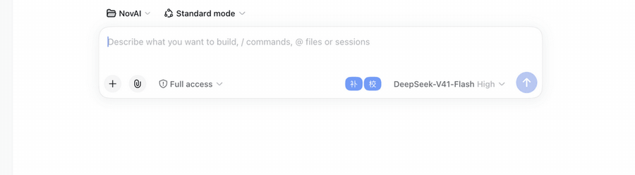

# dsh-input-assist

English | [中文](./README.md)

An input assistant plugin for DeepSeek Harness (`dsh`):



- **Inline completion (ghost text)** — after a typing pause, calls the DeepSeek FIM endpoint (`/beta/completions`) and renders the suggestion **inline right after your cursor** as gray text (the Copilot look: transparent mirror layer, no floating panel). Suggestions appear **progressively via SSE streaming** — the first token hits the screen immediately and the ghost text grows as it generates. `Tab` accepts one word at a time (works mid-stream without breaking the stream), `Shift+Tab` accepts everything, `Esc` dismisses.
- **Typo checking** — two layers: a **dictionary layer that runs entirely in your browser** (228 Chinese wrong phrases + 211 English misspellings / proper-noun capitalizations + 8 context rules; the word lists live as plain text under `data/` and can be merged with a per-browser custom dictionary; highlights in 200 ms, offline, zero cost) plus an LLM context pass (mixed Chinese/English: 在/再, 的/得/地, English spelling; debounced 800 ms, same cadence as completion). Errors are **underlined in red inside the text** (current item highlighted, click red text to select), a navigation bar walks through fixes one by one — never a bulk replace.

## Completion shortcuts (active while a ghost suggestion is visible)

| Action | Shortcut |
| --- | --- |
| Accept one word (Chinese segmented by word) | `Tab` |
| Accept all | `Shift+Tab` |
| Dismiss suggestion | `Esc` |

The shortcut hint shows on a dock line **outside** the input box (same spot as the typo navigation bar) — no overlays inside the input itself.

## Typo-check shortcuts (active while the input is focused and errors are found)

| Action | Shortcut |
| --- | --- |
| Next / previous error | `Ctrl+Shift+.` / `Ctrl+Shift+,` |
| Fix the selected error | `Ctrl+Shift+F` |
| Mark as correct input (no replace) | `Ctrl+Shift+G` |
| Stop reminding for this draft | `Esc` |

## Quick start

```shell
dsh plugin --profile web add dsh-input-assist   # or @honlnk/dsh-input-assist — identical content
dsh --profile web          # start, then open http://127.0.0.1:3080
```

Local development (install from source):

```shell
git clone https://github.com/honlnk/dsh-input-assist && cd dsh-input-assist
npm install && npm run build
dsh plugin --profile web add "$PWD"
```

Website (demo + install guide): https://honlnk.github.io/dsh-input-assist/

API key — pick one of three (needed by completion and the LLM layer; the dictionary layer needs no configuration at all):

1. Do nothing — the plugin automatically reuses the `DEEPSEEK_API_KEY` already saved in dsh (`.credentials.yaml`) or from the environment
2. Fill it in the settings page: gear icon at the bottom of the sidebar → **Plugins → Plugin Settings → Input Assist** card (recommended — every option is graphical)
3. Write `input-assist.completionApiKey: sk-…` in `~/.dsh/settings.yaml`, or run `DEEPSEEK_API_KEY=sk-… dsh web`

## Settings-page card

Every option can be edited graphically in the dsh settings UI: gear icon at the bottom of the sidebar → **Plugins → Plugin Settings**, expand the “Input Assist” card. The interaction mirrors the official sibling cards (Bash / Agent Loop / Web Search): staged edits → one unified “Save / Discard”, numeric and required-text validation, per-field “unsaved” dots and per-field undo (×). The card registers through the official `settings.plugin.item` slot (keyed by settings namespace) — no extra services required, and external edits to the settings file hot-sync back into the card.

The model fields support **fetching the catalog from the API**: click the ▾ square button next to the field to open a custom dropdown that pulls the latest catalog every time it opens; click to fill. The field always stays a free-text input — any custom model name on an OpenAI-compatible endpoint can be typed by hand. If the fetch fails (no key configured, endpoint unreachable) it falls back to manual entry. Default models have followed the official migration: `deepseek-chat` was retired on 2026-07-24; the default is now `deepseek-flash` (V4.1 Flash).

## Custom dictionary (per-browser only)

The “**Custom dictionary (this browser only)**” section at the bottom of the settings card is a paired-entry list: wrong word on the left, correct word on the right, Chinese or English. “＋ Add entry” appends a pair, × deletes a row, drag the row handle to reorder (or focus and move with ↑/↓); add / delete / reorder all animate smoothly.

- Entries are **merged** with the built-in dictionary for the local dictionary-layer scan: an entry with the same wrong word overrides the built-in one; mapping a word to itself (self-mapping) disables checking for that built-in entry; English entries automatically use word-boundary matching (camelCase, snake_case and dot-joined identifiers never false-positive)
- Stored only in this browser's localStorage (key `dsh-input-assist:user-dict:v1`, format is still one `wrong => right` per line) — **never synced via settings.yaml**
- The header row has “**Import / Export / Copy**”: import picks a `.txt` file (one `wrong => right` per line, same format as the built-in lists, `#` comments); same-word entries update in place, the rest append to the staged list — still reviewable before saving. Export downloads the current list (including unsaved edits) as the same `.txt` format; copy goes to the clipboard. That's how you move dictionaries between browsers and machines
- Limits: 2000 entries, wrong word ≤ 16 chars; validation issues (empty words, runs of whitespace, overlong, duplicates) show inline per row and block saving; edits share the card-level “Discard / Save” buttons, and a successful save immediately re-highlights the current draft with the new dictionary

## Configuration (settings.yaml → `input-assist`, or edit graphically via the settings card)

| Key | Default | Description |
| --- | --- | --- |
| `completionEnabled` | `true` | Completion switch (same as the 「补」 button next to the input) |
| `completionBaseUrl` | `https://api.deepseek.com/beta` | FIM endpoint (swap for any OpenAI-compatible one) |
| `completionApiKey` | `''` | Empty = credential fallback |
| `completionModel` | `deepseek-flash` | Completion model (pick from the dropdown in the settings card, ⟳ fetches the catalog from the API) |
| `completionDebounceMs` | `800` | How long after typing stops before requesting (same cadence as the LLM proofread) |
| `completionMaxTokens` | `64` | Suggestion length cap |
| `completionStream` | `true` | Stream completion via SSE for progressive rendering; turn off to receive whole suggestions if the endpoint lacks streaming |
| `proofreadEnabled` | `true` | Typo-check switch (same as the 「校」 button) |
| `proofreadUseLlm` | `true` | Stack the LLM layer on top (off = zero cost) |
| `proofreadModel` | `deepseek-flash` | LLM proofread model (same dropdown) |
| `proofreadDebounceMs` | `800` | LLM-layer debounce (same cadence as completion; both return together) |
| `proofreadDictDebounceMs` | `200` | Dictionary-layer debounce (browser-local scan, zero cost) |

## Development & testing

Sources live in `src/*.ts` (TypeScript strict mode), built with [tsdown](https://tsdown.dev) into two entries:

- `src/index.ts` → `lib/index.js` (ESM + `.d.ts`, the host half, imported directly by the cordis loader)
- `src/client.ts` → `lib/client.js` (CJS, wrapped automatically by `window.__ModuleLoader__.load` via banner/footer, react / dsh-client-runtime kept external, local modules like the dictionary bundled in)

```shell
npm install
npm run build   # tsdown dual-entry build into lib/ (no strict tsc check)
npm test        # build → tsc --noEmit → node --test (type errors caught locally)
```

Dictionary data is maintained as plain text under `data/` (`zh-wrong-phrases.txt` + `en-wrong-spellings.txt` + `en-proper-nouns.txt` line-based lists + `zh-context-rules.json` context rules). Before building, `scripts/gen-dict.mjs` parses, validates and generates `src/proofread-dict-data.generated.ts` (committed to git; CI guards sync via `gendict + git diff`) — to update the dictionaries, just edit the data/ files; `npm run build` picks it up. `test/client-bundle.test.js` executes the real bundle artifact with a fake ModuleLoader, covering the full data → bundle chain. User dictionaries (localStorage) are merged with the built-in lists for scanning, browser-side.

## Architecture at a glance

```
Browser half (lib/client.js, bundled from src/client.ts)      Host half (lib/index.js)
  input.overlay   error hints only (no popup)       loopback    settings namespace input-assist
  input.dock      typo panel + fixes              ───RPC (0.1.5+: fetch route /api/input-assist/rpc;
  input.right     补 / 校 toggles                     ≤0.1.1: rpc.handle /input-assist)───▶
  fetch POST /api/input-assist/stream                complete   → FIM /beta/completions (non-stream)
    ↳ SSE frames drive ghost progressive render      proofread → LLM layer (llmOnly)
  settings.plugin.item  settings card (Plugins → Plugin Settings)   cancel → abort in-flight requests (RPC & stream alike)
  useInput reads draft · inputActions.setDraft writes back          stream route → FIM stream:true, frames {delta}/{done}
  Mirror layer (mounted on body): red errors in text + gray ghost suggestion after the cursor (rAF-batched render)
  Dictionary layer runs locally (single source src/proofread-dict.ts, bundled into the client at build time)
  Ships its own snapshot store (src/snapshot-store.ts, satisfying the host ObservableSnapshot contract)
```

## Status

- [x] Research & feasibility (2026-08-23)
- [x] First release: dual-side plugin scaffold + completion suggestion bar + typo checking (dictionary + LLM layers, click to fix)
- [x] Typo-check redesign (in-text red underline, per-item navigation, mark-as-correct, shortcuts)
- [x] Inline completion redesign (ghost text, Tab word-by-word accept, dictionary layer moved into the browser at 200 ms, LLM/completion unified 800 ms)
- [x] TypeScript rewrite (all of src/ in TS, tsdown dual-entry build, single-source dictionary)
- [x] CI/CD & release (dual-name npm packages, Trusted Publishing with no token, GitHub Pages website)
- [x] Settings card (Settings → Plugins → Plugin Settings: 11 staged-editable options, save/discard, local validation)
- [x] Model catalog fetching (models.list RPC + dropdown suggestion combobox; default model migrated to deepseek-flash)
- [x] Externalized dictionaries & custom dictionary (data/ plain-text lists + gen-dict generator + CI sync guard; browser localStorage custom dictionary edited in the settings card)
- [x] English spell checking (misspelling + proper-noun dictionaries, word-boundary scanning; LLM layer proofs mixed Chinese/English)
- [x] Real-Chrome UX acceptance: shortcuts field-tested (passed 2026-09-13; clicks, settings card, dictionary section verified on a real dsh on 2026-09-12)
- [x] In-flight request cancellation (retyping re-schedules / Esc / toggling off aborts pending completion and LLM requests; late responses never resurrect and never burn tokens; verified on real hardware 2026-09-13, including Esc inside the debounce window)
- [x] Custom-dictionary import/export (same .txt format: import merges into the staged list, export downloads / copies to clipboard; verified 2026-09-13)
- [x] Streaming progressive render (SSE first-token progressive display + mid-stream cut-off; code & tests done, accepted on real hardware 2026-09-20: SSE frames driving ghost growth, mid-stream Tab accept)
- [x] dsh 0.1.5-rc.2 compatibility (2026-09-15: cordis webServer injection, client-runtime-less snapshot store takeover, RPC over fetch dual path; compatible with the old 0.1.1 runtime — 116 tests green + real-machine curl smoke)
- [x] Composer contenteditable compatibility (2026-09-20: the 0.1.5 composer switching to a Lexical contenteditable silently broke ghost text; findComposer for both runtimes, cursor block-level walk, mirror layer / Tab accept / keyboard interception adapted end-to-end, accepted in a real browser — see [docs/17](./docs/17-输入框contenteditable适配.md))

## Release process

Pushing a `v*` tag triggers automatically (version must match package.json):

- **Release npm** — after tests pass, one publish under both names: `dsh-input-assist` (bare) + `@honlnk/dsh-input-assist` (scoped mirror), identical content. Auth via npm Trusted Publishing (OIDC), no NPM_TOKEN; already-published names are skipped (idempotent).
- **Deploy Pages** — site files under `docs/` deploy to GitHub Pages.

One-time setup: a Trusted Publisher entry on npmjs.com for **each of the two package names** (repo `honlnk/dsh-input-assist`, workflow `release-npm.yml`, environment empty); GitHub Settings → Pages → Source set to “GitHub Actions”.

```shell
git tag v0.1.0 && git push origin v0.1.0   # that's the release
```

## Community

- [Show Your Plugins! thread](https://github.com/deepseek-ai/deepseek-harness/discussions/6313) — bilingual intro post in the dsh upstream discussion board, feedback welcome
- [Blog: Copilot-style input for DeepSeek Harness](https://blog.honlnk.com/ai/tools/dsh-input-assist) — a user-perspective feature tour (Chinese)
- More dsh plugins: GitHub topic [`dsh-plugin`](https://github.com/topics/dsh-plugin)

## Uninstall

```shell
dsh plugin --profile web remove dsh-input-assist
```
